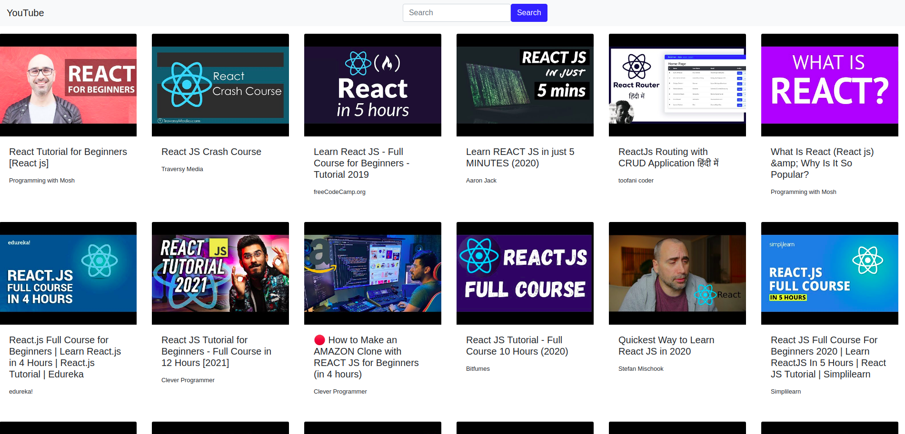
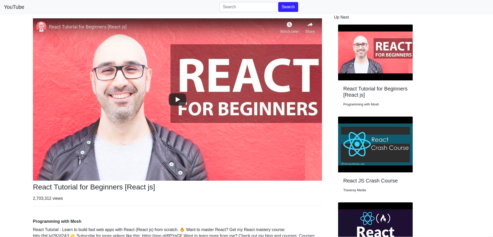

# Youtube Clone (ReactJs and YouTube API v3)

Using this application you can search and play videos just like YouTube. This application uses the [YouTube API v3](https://developers.google.com/youtube/v3) to extract video data and details.

## Technical Description
This application is built with [React](https://reactjs.org/) and context API. React helps creating reusable components quite easily that can be used across various projects.

Upon searching a video user is shown 50 relevent videos to the query on the search screen.

## Interface

It has a responsive interface!

### Video Search Screen


### Video Display Screen


## Instructions

Following are the instructions that you need perform in order to run the application.

1. [Clone the repository](#clone-the-repository)
1. [Environment Setup](#environment-setup)
1. [Running the Application](#running-the-application)
1. [Troubleshooting](#troubleshooting)

## Clone the Repository

Clone this repository and switch to the `youtube` branch as it currently contains the latest code. Run the following commands on your shell.

``` shell
git clone https://github.com/ahmadx16/YoutubeClone.git
cd YoutubeClone/
git checkout youtube
``` 

The above commands will download the repository and switch the branch.

## Environment Setup

This application requires [Nodejs and npm](https://nodejs.org/en/) (npm now comes with node by default) installed on the system to execute. You can learn how to install on provided links. It is recommended to install latest version of node and npm. 
After you have installed node and npm run following command.

``` shell
npm install
```

This command will install all the packages that has been specified in `package.json` file.

## Running the Application

Run following command to start the application

``` shell
npm start
```

The above command will start the development server on `http://localhost:3000`

## Troubleshooting

On running command `npm start` you may or may not get the error `Error: ENOSPC: System limit for number of file watchers reached` . It occurs when system file watching limit exceeds. You can simply fix this error either by using command `sudo npm start` or increasing the file watchers limit. Learn about how to increase file watchers on Ubuntu [here](https://stackoverflow.com/questions/55763428/react-native-error-enospc-system-limit-for-number-of-file-watchers-reached)


___
This project was bootstrapped with [Create React App](https://github.com/facebook/create-react-app).
